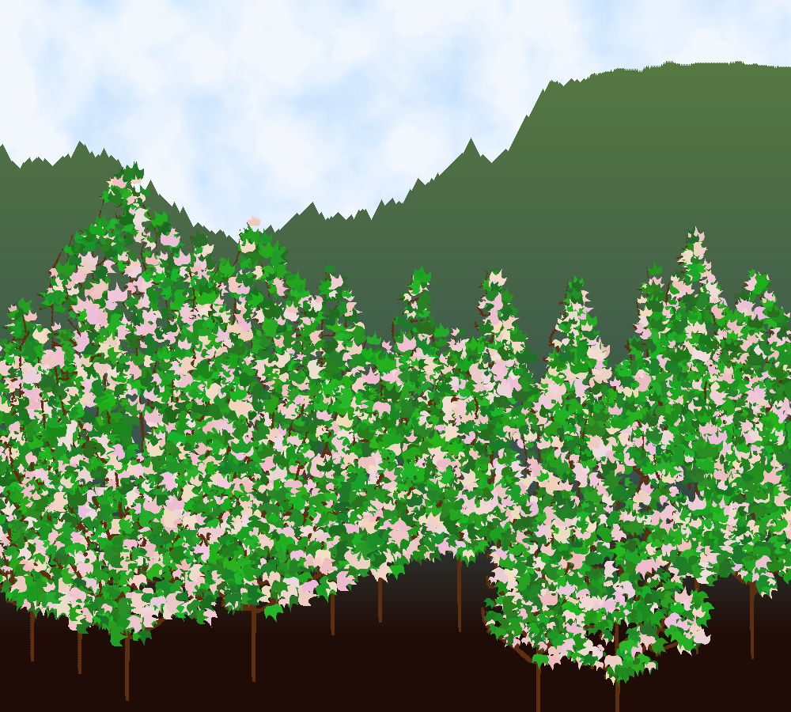
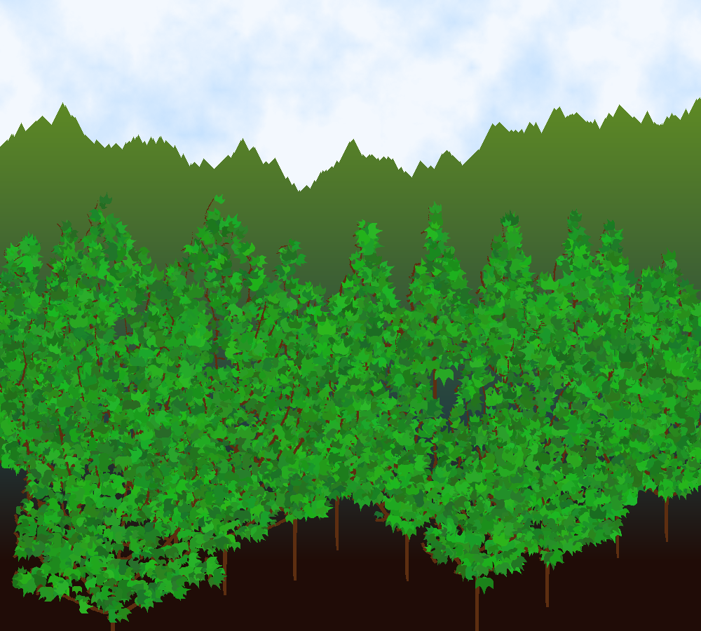
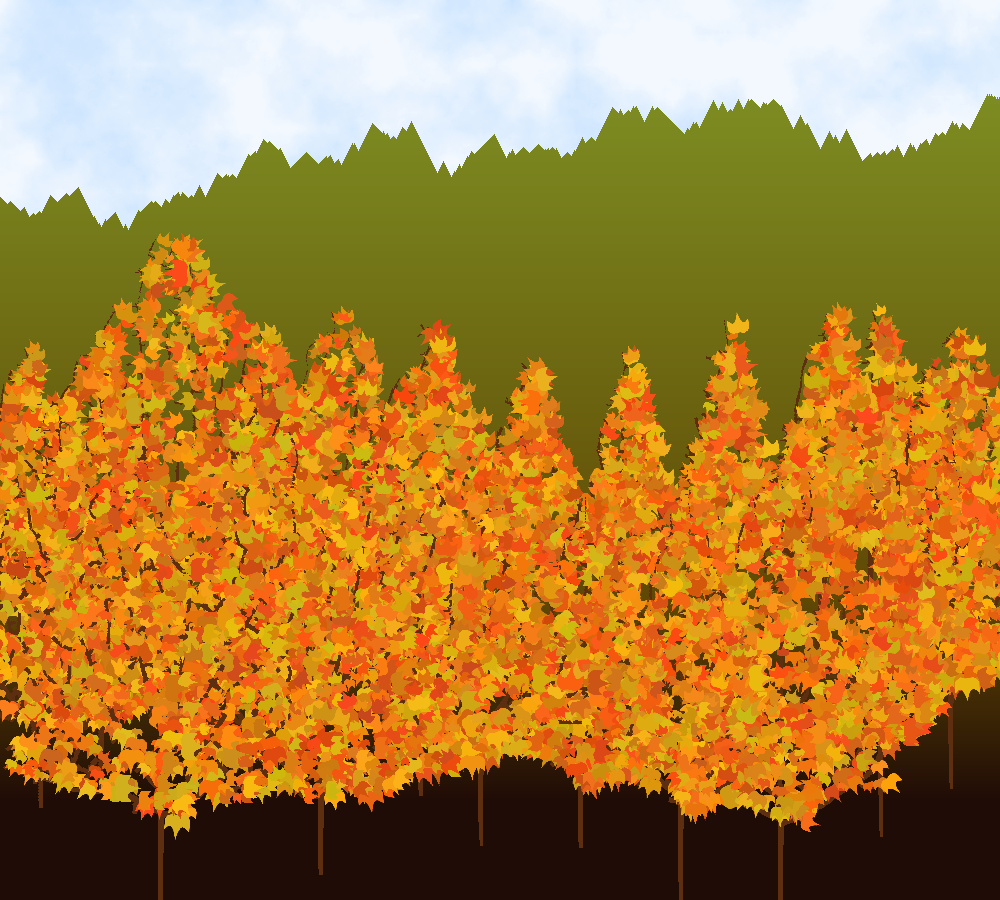
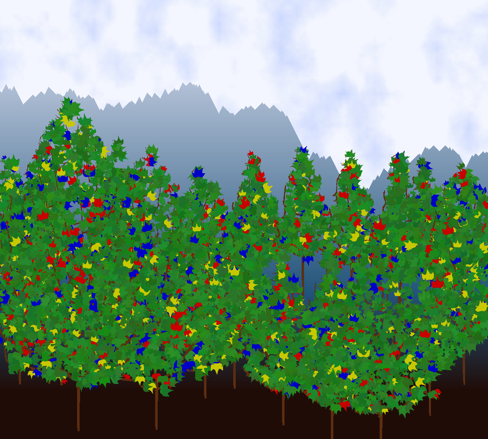
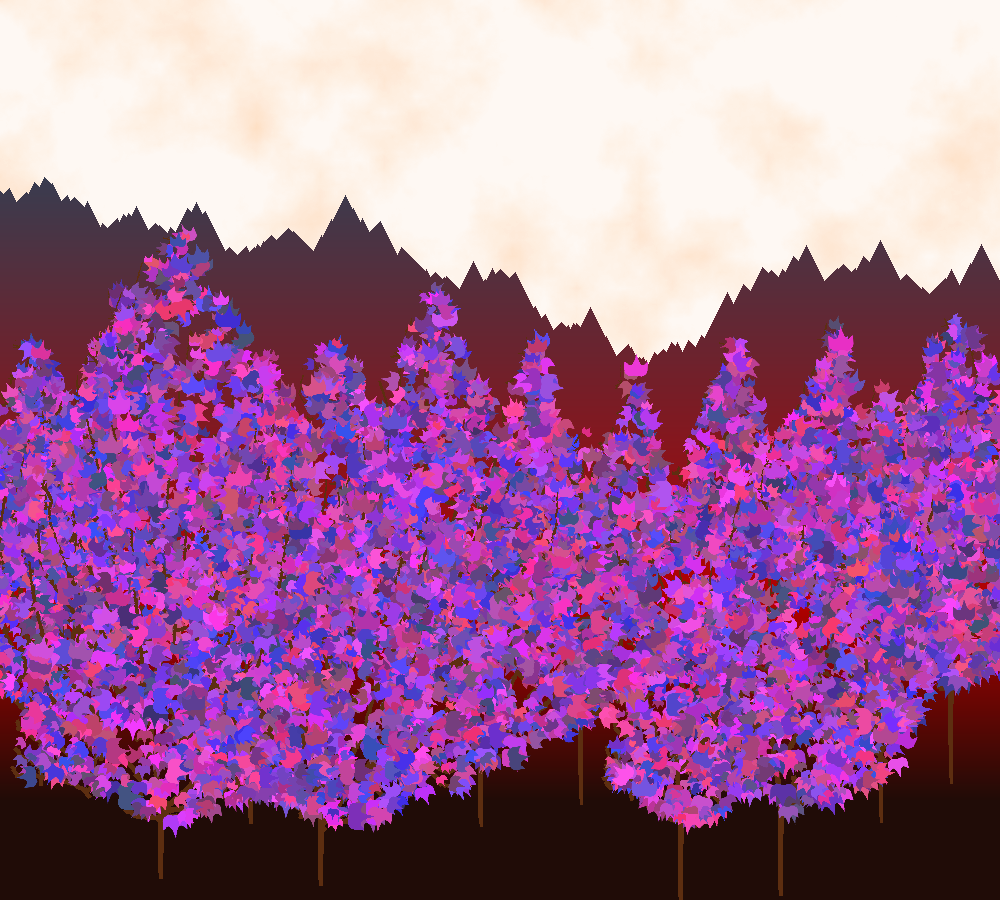

# Van_Gogu  

Draws a landscape procedurally. A leaf is drawn as a bezier curve, then the tree, sky texture and mountains are generated procedurally. The executable can be started from a web page to watch some matrix style animation while the image is generating.  

Results:  

[Trees tutorial](http://www.jgallant.com/procedurally-generating-trees-with-space-colonization-algorithm-in-xna/)  
[Clouds tutorial](http://lodev.org/cgtutor/randomnoise.html)  
